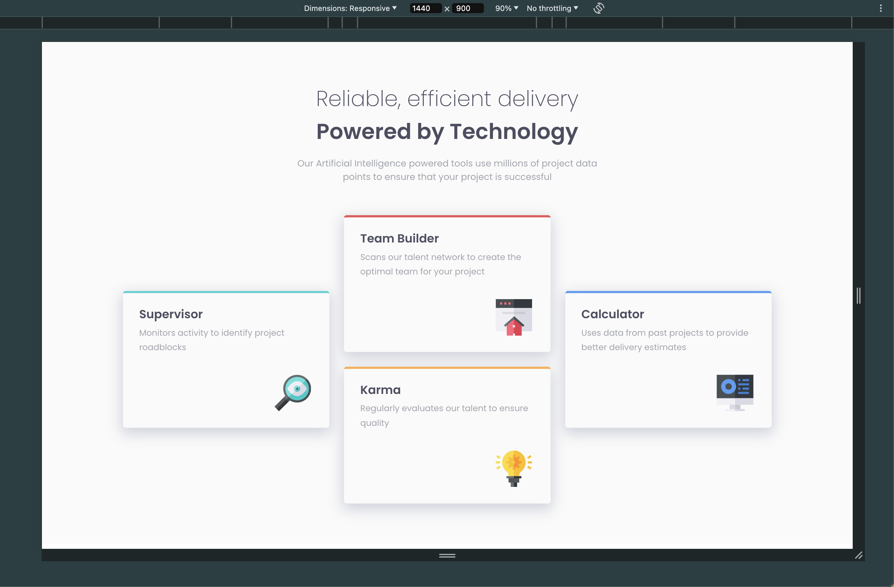
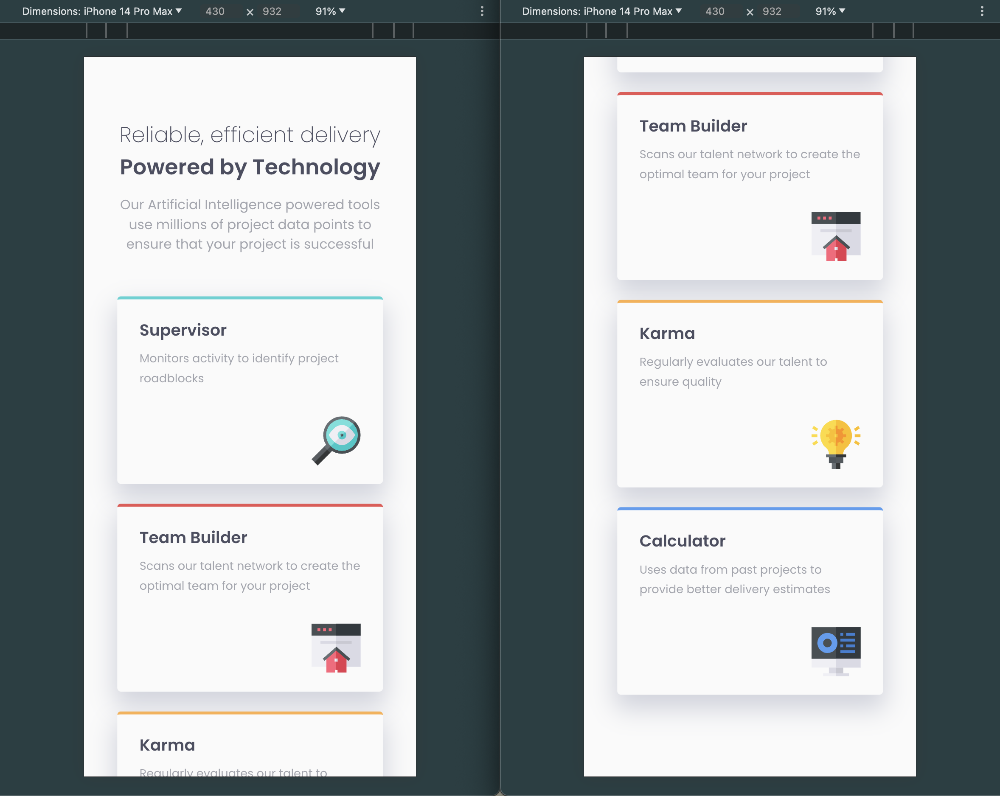

# Product Preview Card Component

This is my solution to the [Product preview card component challenge on Frontend Mentor](https://www.frontendmentor.io/challenges/product-preview-card-component-GO7UmttRfa).

## Table of contents

- [Overview](#overview)
  - [Screenshot](#screenshot)
  - [Links](#links)
- [My process](#my-process)
  - [Built with](#built-with)
  - [What I learned](#what-i-learned)
  - [Continued development](#continued-development)
- [Author](#author)

## Overview

### Screenshot

Here is the outcome of my solution, which is compatible with various platforms and sizes:

- Web result

- Mobile result

### Links

- Solution URL: [https://github.com/rainof/four-card-feature-project](https://github.com/rainof/four-card-feature-project)
- Live Site URL: [https://rainof.github.io/four-card-feature-project](https://rainof.github.io/four-card-feature-project)
